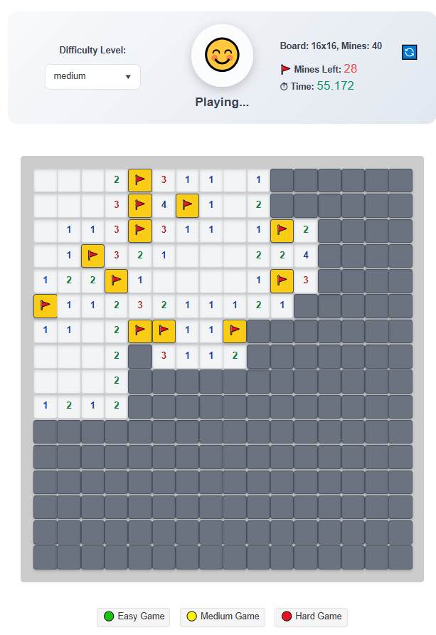
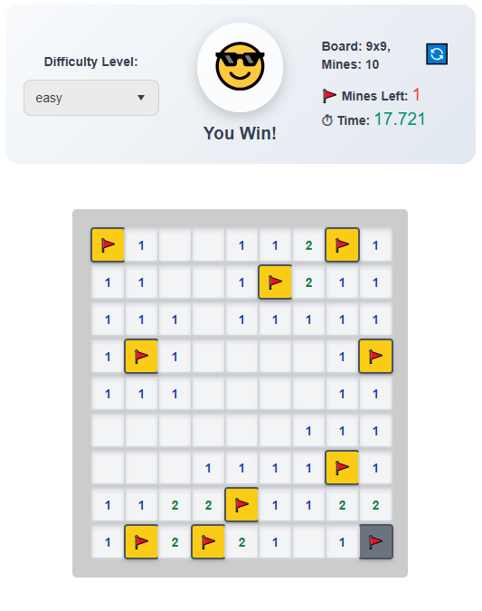
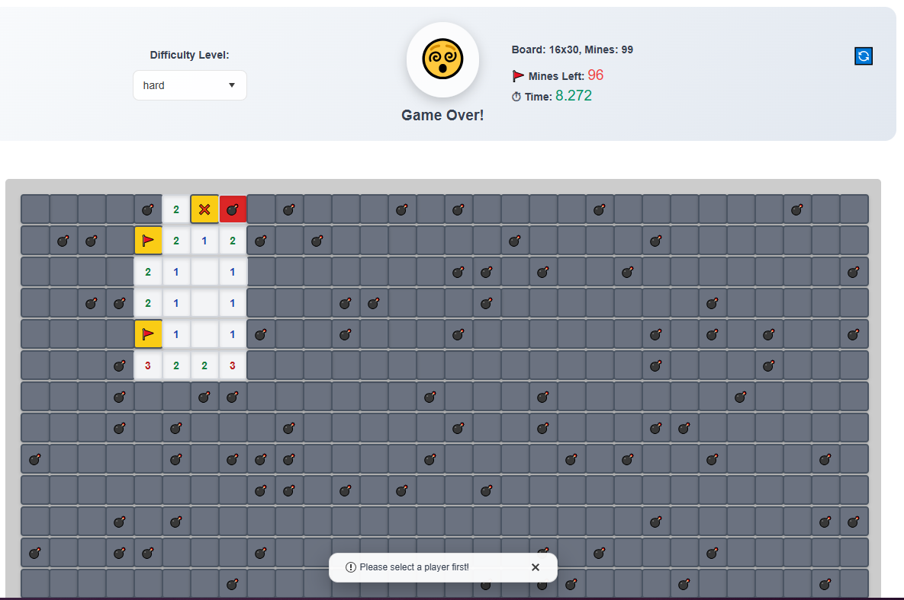
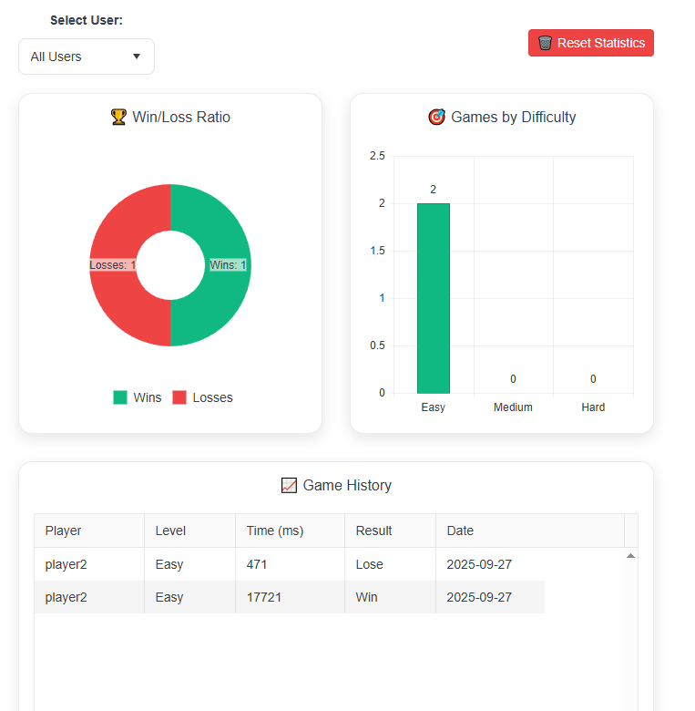
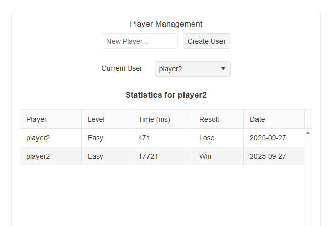

# 🚀 KendoReact Minesweeper Challenge

I built a modern Minesweeper game using KendoReact free components for the DEV Challenge!

## 🎮 What I Built

A complete gaming dashboard featuring:
- Classic Minesweeper gameplay with 3 difficulty levels
- Real-time analytics and statistics
- Player profile management

## 🔗 Links

- **🌐 Live Demo**: https://kendo-blue.vercel.app/
- **💻 Source Code**: https://github.com/kajor7qp/kendo

## ✨ Features

### Core Gameplay
- Classic Minesweeper mechanics (left-click reveal, right-click flag)
- Three difficulty levels: Easy (9x9), Medium (16x16), Hard (16x30)
- Real-time timer and mine counter
- Smart first-click protection

### Modern Dashboard
- **Analytics Tab**: Win/Loss charts and difficulty statistics
- **Player Profile**: Name input and game date tracking
- **Smooth Animations**: Hover effects and transitions

## 🛠️ KendoReact Components Used (11+)

1. **Button** - Level selection and game actions
2. **DropDownList** - Difficulty level selection
3. **Grid** - Game statistics table
4. **Chart** - Analytics visualization (2 different charts)
5. **Card** - Structured layout sections
6. **TabStrip** - Navigation between game/stats/profile
7. **Notification** - Game over/win alerts
8. **Input** - Player name input
9. **Loader** - Loading animations
10. **NotificationGroup** - Notification management

## 🎨 Technical Highlights

- **Modern UI**: Glassmorphism design with gradient backgrounds
- **State Management**: Complex game state with React hooks
- **Game Logic**: Complete Minesweeper algorithm implementation
- **Statistics**: Real-time game tracking and analytics

# Developping
## 🚀 Getting Started
``` bash
git clone https://github.com/kajor7qp/kendo
cd kendo
npm install
npm run dev
``` 

# KendoReact Components Used in Minesweeper Application

The following KendoReact components are used in the Minesweeper application, based on the provided code in `App.jsx`, `GameTab.jsx`, `StatisticsTab.jsx`, `Header.jsx`, and `ProfileTab.jsx`.

## Primary Components
1. **Button** (`@progress/kendo-react-buttons`)
    - **Usage**: Reset game, select difficulty levels, reset statistics, create users.
    - **Files**: `GameTab.jsx` (difficulty buttons, `Header` reset), `StatisticsTab.jsx` (reset statistics), `ProfileTab.jsx` (create user), `Header.jsx` (reset game).
    - **Purpose**: Triggers actions like starting a new game, changing difficulty, resetting statistics, or adding users.

2. **DropDownList** (`@progress/kendo-react-dropdowns`)
    - **Usage**: Select difficulty level, select active user for statistics or user management.
    - **Files**: `GameTab.jsx` (difficulty), `StatisticsTab.jsx` (user selection), `ProfileTab.jsx` (active user).
    - **Purpose**: Allows selection from predefined options (e.g., easy/medium/hard, usernames).

3. **Card** (`@progress/kendo-react-layout`)
    - **Usage**: Structures content for game features, statistics charts, and user management.
    - **Files**: `GameTab.jsx` (game features), `StatisticsTab.jsx` (charts and grid), `ProfileTab.jsx` (user management).
    - **Sub-components**: Includes `CardHeader`, `CardBody`, `CardTitle`.
    - **Purpose**: Organizes content in visually appealing cards.

4. **TabStrip** (`@progress/kendo-react-layout`)
    - **Usage**: Navigation tabs for switching between game, statistics, and user views.
    - **Files**: `App.jsx`.
    - **Sub-components**: Includes `TabStripTab`.
    - **Purpose**: Provides tabbed navigation interface.

5. **Notification** (`@progress/kendo-react-notification`)
    - **Usage**: Displays feedback messages for user actions (e.g., resetting statistics).
    - **Files**: `App.jsx`.
    - **Purpose**: Shows temporary notifications.

6. **NotificationGroup** (`@progress/kendo-react-notification`)
    - **Usage**: Groups notifications for consistent positioning.
    - **Files**: `App.jsx`.
    - **Purpose**: Manages notification placement (e.g., bottom center).

7. **Loader** (`@progress/kendo-react-indicators`)
    - **Usage**: Indicates loading state during game board initialization.
    - **Files**: `GameTab.jsx`.
    - **Purpose**: Shows a loading spinner when resetting the game.

8. **Grid** (`@progress/kendo-react-grid`)
    - **Usage**: Displays game history and user-specific statistics in tables.
    - **Files**: `StatisticsTab.jsx` (game history), `ProfileTab.jsx` (user statistics).
    - **Sub-components**: Includes `GridColumn`.
    - **Purpose**: Presents tabular data with sortable columns.

9. **Chart** (`@progress/kendo-react-charts`)
    - **Usage**: Visualizes Win/Loss Ratio (donut chart) and Games by Difficulty (column chart).
    - **Files**: `StatisticsTab.jsx`.
    - **Sub-components**: Includes `ChartSeries`, `ChartSeriesItem`, `ChartTitle`, `ChartLegend`.
    - **Purpose**: Displays graphical statistics.

10. **Input** (`@progress/kendo-react-inputs`)
    - **Usage**: Allows entering a new username for user creation.
    - **Files**: `ProfileTab.jsx`.
    - **Purpose**: Provides text input for usernames.

## Notes
- **Total Components**: 10 primary components are used, with sub-components (`CardHeader`, `CardBody`, `CardTitle`, `TabStripTab`, `GridColumn`, `ChartSeries`, `ChartSeriesItem`, `ChartTitle`, `ChartLegend`) supporting the primary ones.
- **CDN Dependencies**: The components are loaded via CDN, requiring packages:
    - `@progress/kendo-react-buttons`
    - `@progress/kendo-react-dropdowns`
    - `@progress/kendo-react-layout`
    - `@progress/kendo-react-notification`
    - `@progress/kendo-react-indicators`
    - `@progress/kendo-react-grid`
    - `@progress/kendo-react-charts`
    - `@progress/kendo-react-inputs`
    - 





